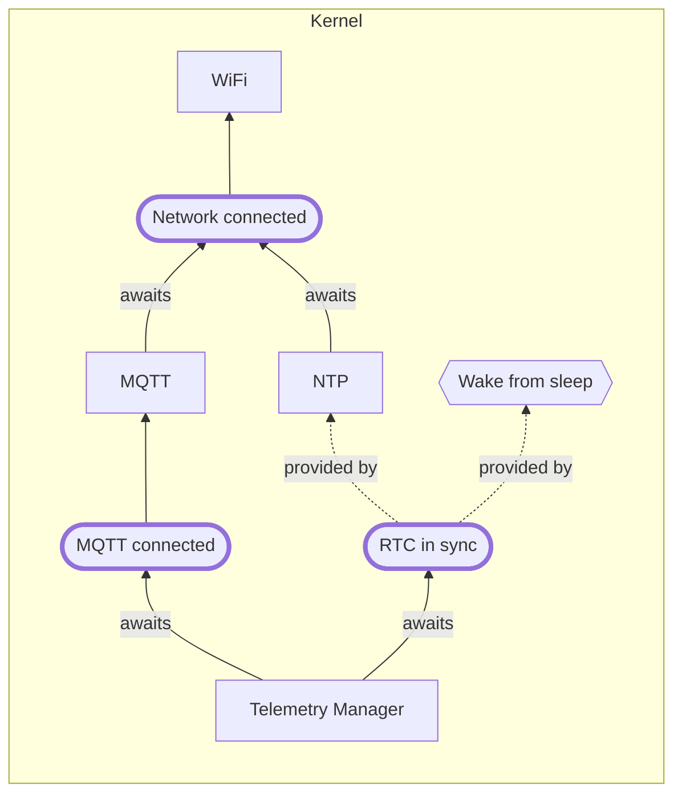
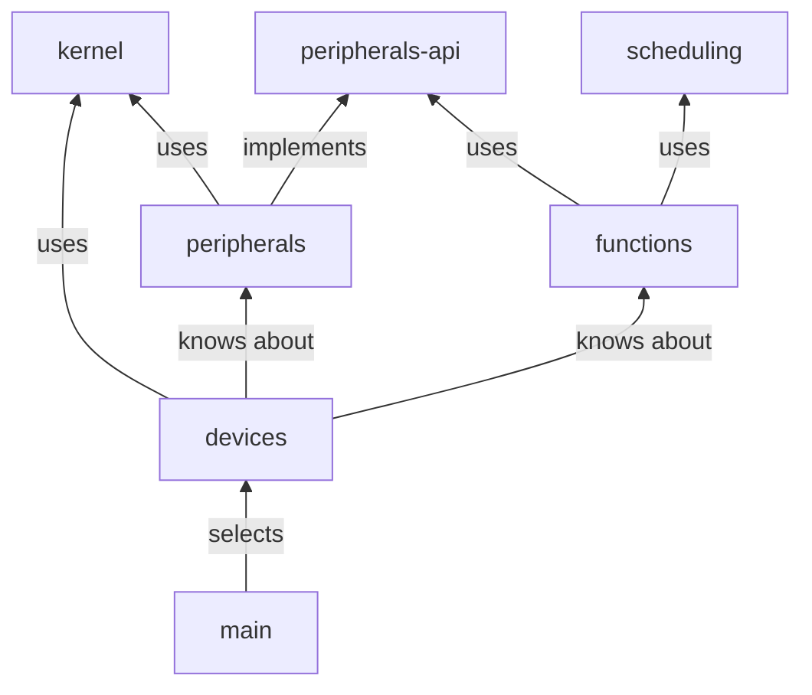

# Architecture

## System layers

The firmware is organized into five conceptual layers, from low-level to high-level:

```
┌──────────────────────────────────────────┐
│               Functions                  │  PlotController, ChickenDoor
├──────────────────────────────────────────┤
│              Peripherals                 │  Sensors, valves, motors, displays
├──────────────────────────────────────────┤
│          Peripheral factories            │  Create peripherals from JSON config
├──────────────────────────────────────────┤
│         Device (hardware model)          │  Pin assignments, on-board drivers
├──────────────────────────────────────────┤
│               Kernel                     │  WiFi, MQTT, NTP, Telemetry
└──────────────────────────────────────────┘
```

## Kernel

The kernel provides the shared runtime services every device relies on:



Key services:

- **WiFi** — manages the station connection; publishes the `NetworkConnected` event.
- **MQTT** — connects to the broker once the network is up; publishes `MQTTConnected`.
- **NTP** — synchronizes the RTC after the network comes up.
- **TelemetryManager** — collects telemetry from registered providers and publishes it once MQTT and the RTC are both ready.
- **PowerManager** / **BatteryManager** — optional battery monitoring and sleep management.
- **NVS** / **Configuration** — persistent key-value store for device and network config.

## Device (hardware model)

Each hardware revision is a concrete C++ class that:

- Declares pin assignments and on-board peripherals (status LED, PWM channels, I2C buses).
- Registers a `BatteryManager` if the board has a battery.
- Provides peripheral factories used by `PeripheralManager`.

The active device class is selected at boot:

1. **Compile-time override (`UD_GEN`)** — pass e.g. `-DMK7` to force a specific model; useful for Wokwi simulation.
2. **Runtime MAC detection** — `main.cpp` checks the device MAC address prefix and instantiates the matching class.
3. **Fallback** — `GenericDevice` is used with a warning if the MAC is not recognized.

### Platform and model matrix

| Platform | ESP-IDF target | Models |
| -------- | -------------- | ------ |
| **Spinach** | `esp32s3` | MK5, MK6 (rev1–rev3), MK7, MK8 (rev1–rev2), MK9 rev1 |
| **Carrot** | `esp32c6` | MK9 rev2 |

Each platform produces a single firmware binary. The model and revision are reported in boot logs and in the MQTT `init` message.

## Peripherals and functions

See [Components.md](Components.md) for the full conceptual model. In brief:

- A **peripheral** is a physical element connected to the device (sensor, valve, motor).
- A **function** is a logical grouping of peripherals that implements a real-world capability (e.g. `PlotController`, `ChickenDoor`).
- `PeripheralManager` reads the device config from NVS and uses peripheral factories to instantiate peripherals at runtime. It also registers each peripheral as a telemetry provider with `TelemetryManager`.

## Scheduling

The `scheduling` component contains independent scheduling strategies used by `PlotController`:

- `TimeBasedScheduler` — fixed daily schedule.
- `MoistureBasedScheduler` — responds to soil moisture levels (optionally with a Kalman filter).
- `LightSensorScheduler` — responds to ambient light (used by `ChickenDoor`).
- `DelayScheduler` — simple delay-based control.
- `CompositeScheduler` / `OverrideScheduler` — combine and override other schedulers.

## MQTT topic structure

```
/devices/ugly-duckling/$INSTANCE/          ← device root
    init                                   ← boot announcement
    telemetry                              ← periodic telemetry (all features)
    commands/$COMMAND                      ← retained command messages
    responses/$COMMAND                     ← command responses
    peripheral/$PERIPHERAL_NAME/config     ← per-peripheral runtime config
```

## Component dependency graph


