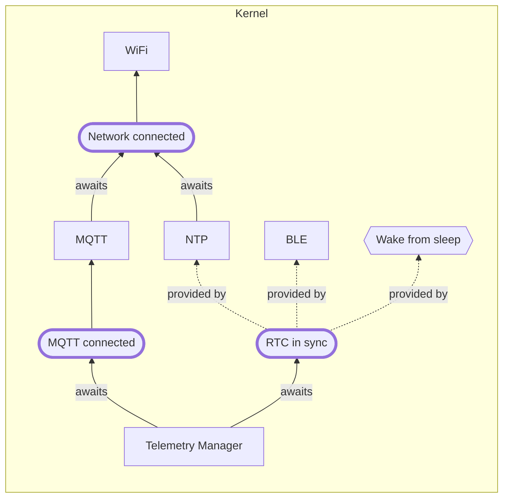
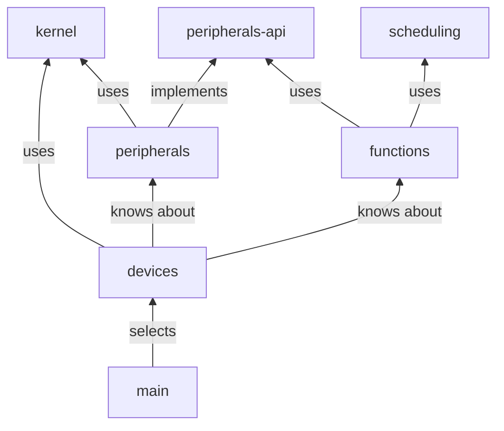

# Architecture

## System layers

The firmware is organized into five conceptual layers, from low-level to high-level:

```
┌──────────────────────────────────────────┐
│               Functions                  │  PlotController, ChickenDoor
├──────────────────────────────────────────┤
│              Peripherals                 │  Sensors, valves, motors, displays
├──────────────────────────────────────────┤
│          Peripheral factories            │  Create peripherals from JSON config
├──────────────────────────────────────────┤
│         Device (hardware model)          │  Pin assignments, on-board drivers
├──────────────────────────────────────────┤
│               Kernel                     │  WiFi, MQTT, NTP, Telemetry
└──────────────────────────────────────────┘
```

## Kernel

The kernel provides the shared runtime services every device relies on:


```mermaid
graph BT
    subgraph Kernel
        direction BT
        BLE
        WiFi
        NetworkConnected(["Network connected"])
            style NetworkConnected stroke-width:4
        NTP
        RTCInSync(["RTC in sync"])
            style RTCInSync stroke-width:4
        MQTT
        MQTTConnected(["MQTT connected"])
            style MQTTConnected stroke-width:4
        TelemetryManager["Telemetry Manager"]

        NetworkConnected --> WiFi
        MQTT -->|awaits| NetworkConnected
        MQTTConnected --> MQTT
        NTP -->|awaits| NetworkConnected
        RTCInSync -.->|provided by| NTP
        RTCInSync -.->|provided by| BLE
        RTCInSync -.->|provided by| PreBoot{{"Wake from sleep"}}
        TelemetryManager -->|awaits| MQTTConnected
        TelemetryManager -->|awaits| RTCInSync
    end
```

Key services:

- **BLE** (`BleDriver`) — starts NimBLE unconditionally at boot; advertises the device and hosts the standard Device Information Service (DIS, UUID 0x180A). Future roles: provisioning and local-only (WiFi-free) operation.
- **WiFi** — manages the station connection; publishes the `NetworkConnected` event.
- **MQTT** — connects to the broker once the network is up; publishes `MQTTConnected`.
- **NTP** — synchronizes the RTC after the network comes up. See [Time acquisition](#time-acquisition).
- **TelemetryManager** — collects telemetry from registered providers and publishes it once MQTT and the RTC are both ready.
- **PowerManager** / **BatteryManager** — optional battery monitoring and sleep management.
- **NVS** / **Configuration** — persistent key-value store for device and network config.

## Time acquisition

Boot blocks on the `RTC in sync` state before any peripheral is initialized (`Device.hpp`), so
everything downstream can assume a real wall-clock time. This matters for scheduling as much as for
telemetry: a schedule evaluated against time-since-boot would fire at the wrong moment, and the
server keys telemetry rows on the timestamp the device itself reports.

`RtcDriver` signals that state from three sources:

| Source | When | Availability |
| ------ | ---- | ------------ |
| Retained RTC | Immediately at construction, if the clock survived the reset | Soft reset only — a power cycle loses it |
| SNTP | Once the network is up | All platforms |
| BLE Current Time Service | Whenever an external central pushes a time | Carrot only — BLE is disabled on Spinach |

**The state is armed on the clock, never on the outcome of a call.** Every path checks `isTimeSet()`
— the system clock is past 2022-01-01 — before signalling, because a sync can report success while
leaving the clock near the boot epoch. `StateSource` is a one-way latch that nothing clears, so
arming it on a bad clock would permanently mark the device as holding good time: it would keep
publishing, and every status the server can see would look healthy while the timestamps read 1970.

### SNTP servers

Three server slots are configured, tried in order:

| Slot | Server |
| ---- | ------ |
| 0 | Supplied by DHCP, if the lease offers one |
| 1 | `ntp.host` from `network-config.json`, if set |
| 2 | `pool.ntp.org` |

The split exists because lwIP writes DHCP-supplied servers starting at slot 0 and NULLs out every
slot after them. Reserving slot 0 for DHCP (`index_of_first_server = 1`, with
`CONFIG_LWIP_DHCP_MAX_NTP_SERVERS` pinned to 1) lets esp-netif restore ours behind it on each new
lease, so a DHCP offer takes precedence without ever becoming the only option.

### Lifecycle

The SNTP client is initialized in `RtcDriver`'s constructor — before WiFi associates, since lwIP
only keeps the NTP server from a DHCP lease if DHCP server mode is already enabled when that lease
is processed — and started once the network is ready. It then stays alive for the lifetime of the
device, and a task observes its sync notifications rather than driving the retries itself:

- First request after a random 0–5 s delay (`CONFIG_LWIP_SNTP_MAXIMUM_STARTUP_DELAY`), which keeps a
  fleet rebooting together from hitting the public pool in one burst.
- Failed requests retry from 15 s, doubling up to 150 s.
- After a successful sync, lwIP re-polls hourly (`CONFIG_LWIP_SNTP_UPDATE_DELAY`).

Smooth sync is enabled, so small corrections are slewed with `adjtime()` rather than stepped; deltas
over ~35 minutes fall back to `settimeofday()`, which is what happens on every cold boot.

Keeping one client alive is deliberate. Tearing it down and rebuilding it per attempt discards the
resolved server address and lwIP's retry state, which is what previously left devices unable to
acquire time until they were power-cycled.

### Diagnostics

Time problems are hard to reconstruct after the fact, so the failure path logs what distinguishes
the causes: the error code from each sync wait, every server slot with its RFC 5905 reachability
register (whether requests went out and whether anything answered), the time value a server actually
sent, and — for every arming of `RTC in sync` — which source armed it and what the clock read at
that moment.

## Device (hardware model)

Each hardware revision is a concrete C++ class that:

- Declares pin assignments and on-board peripherals (status LED, PWM channels, I2C buses).
- Registers a `BatteryManager` if the board has a battery.
- Provides peripheral factories used by `PeripheralManager`.

The active device class is selected at boot:

1. **Compile-time override (`UD_GEN`)** — pass e.g. `-DMK7` to force a specific model; useful for Wokwi simulation.
2. **Runtime MAC detection** — `main.cpp` checks the device MAC address prefix and instantiates the matching class.
3. **Fallback** — `GenericDevice` is used with a warning if the MAC is not recognized.

### Platform and model matrix

| Platform | ESP-IDF target | Models |
| -------- | -------------- | ------ |
| **Spinach** | `esp32s3` | MK5, MK6 (rev1–rev3), MK7, MK8 (rev1–rev2), MK9 rev1 |
| **Carrot** | `esp32c6` | MK10 rev1 |

Each platform produces a single firmware binary. The model and revision are reported in boot logs and in the MQTT `init` message.

## Peripherals and functions

See [Components.md](Components.md) for the full conceptual model. In brief:

- A **peripheral** is a physical element connected to the device (sensor, valve, motor).
- A **function** is a logical grouping of peripherals that implements a real-world capability (e.g. `PlotController`, `ChickenDoor`).
- `PeripheralManager` reads the device config from NVS and uses peripheral factories to instantiate peripherals at runtime. It also registers each peripheral as a telemetry provider with `TelemetryManager`.

## Scheduling

The `scheduling` component contains independent scheduling strategies used by `PlotController`:

- `TimeBasedScheduler` — fixed daily schedule.
- `MoistureBasedScheduler` — responds to soil moisture levels (optionally with a Kalman filter).
- `LightSensorScheduler` — responds to ambient light (used by `ChickenDoor`).
- `DelayScheduler` — simple delay-based control.
- `CompositeScheduler` / `OverrideScheduler` — combine and override other schedulers.

## MQTT topic structure

The device's MQTT topic root depends on whether it has been re-addressed (see
[`specs/device-readdressing.md`](specs/device-readdressing.md)):

```
d/$ID/                                     ← device root (re-addressed devices)
    boot                                   ← boot announcement, diagnostics
    sync                                   ← fingerprint manifest of applied config
    update                                 ← incoming configuration
    telemetry                              ← periodic telemetry (all features)
    commands/$COMMAND                      ← retained command messages
    responses/$COMMAND                     ← command responses
```

Legacy devices still pending migration use `/devices/ugly-duckling/$INSTANCE/` as the topic root.

See [Configuration.md](Configuration.md) for how `boot`/`sync`/`update` reconcile configuration.

## Component dependency graph


```mermaid
graph BT
    kernel
    devices -->|uses| kernel
    peripherals-api
    peripherals -->|implements| peripherals-api
    peripherals -->|uses| kernel
    scheduling
    functions -->|uses| peripherals-api
    functions -->|uses| scheduling
    devices -->|knows about| peripherals
    devices -->|knows about| functions
    main -->|selects| devices
```
