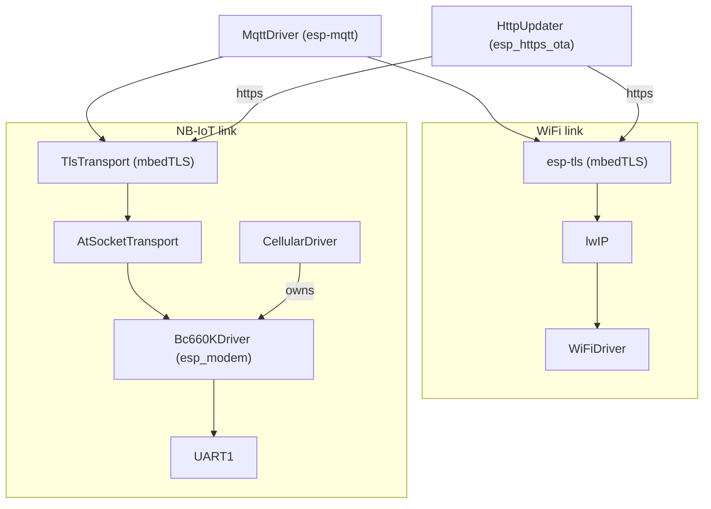

# Connectivity

A device reaches the MQTT broker, and downloads firmware updates, over one of two links:

- **WiFi**, on every board (Spinach and Carrot).
- **NB-IoT**, through the Quectel BC660K-GL on the Desert Lark daughter board: Carrot builds on MK13
  boards only.

The link is chosen at boot from network-config, and only that link's driver is started. Both
drivers report the same network states, so MQTT, telemetry and the rest of the firmware don't need
to know which link is in use.

This document describes how both links work today. The design history of the NB-IoT link, the
bench measurements behind its numbers, and what's planned next are in
[`specs/NB-IoT.md`](specs/NB-IoT.md).

## Overview



TLS follows the URL's scheme on both links: an `http://` firmware URL is fetched unencrypted, with
no certificate check.

| | WiFi | NB-IoT |
| --- | --- | --- |
| Platforms | Spinach, Carrot | Carrot, MK13 boards |
| Driver | `WiFiDriver` | `CellularDriver`, `Bc660KDriver` |
| IP stack | lwIP | The modem's own, through AT socket commands |
| TLS | esp-tls | `TlsTransport`, mbedTLS over the AT socket |
| Time | SNTP | NITZ from the network, NTP through the modem as a fallback |
| Telemetry section | `wifi` | `cellular` |

## Choosing the link

The `links` field in network-config lists the links to use, in order of preference. For now
exactly one entry is supported:

```json
"links": ["cellular"],
"cellular": {
  "edrxCycle": 0
}
```

`chooseNetworkLink()` (`NetworkLink.hpp`) turns it into a link:

| `links` | Link | Logged |
| ------- | ---- | ------ |
| missing or empty | WiFi | nothing, as every device did before the field existed |
| `["wifi"]` | WiFi | |
| `["cellular"]` on a device with a modem | NB-IoT | |
| `["cellular"]` on a device without one | WiFi | an error |
| more than one entry, or an unknown one | WiFi | an error |

A device has a modem only on Carrot builds (`UD_PLATFORM_CARROT`, set by CMake), and only on boards
whose device definition returns modem pins (`DeviceDefinition::getCellularModemPins()`, which only
MK13 overrides). The `cellular` section holds the modem settings and is only used on the NB-IoT
link (see [Sleep](#sleep)).

Changing the link reboots the device, like any other network-config change. Network-config also
carries the device's client key, so every change to `links` comes with a freshly issued client
certificate and key. A link change is confirmed as soon as the device boots with it, so switching a
device without coverage to `cellular` leaves it unreachable until someone gets to it.

`initConnectivity()` (`Connectivity.cpp`) starts the chosen link's driver, along with an `RtcDriver`
set up for that link. The result is a `ConnectivityDrivers` struct. In it, the other link's driver
is `nullptr`, and `modemTransport` holds the transport that MQTT and updates use over NB-IoT
(`nullptr` on WiFi, meaning lwIP). The BOOT message reports the link in use as `connectivity`.

### Network states

Both drivers set the same two states in `ModuleStates`. `MqttDriver` waits for `networkReady`
before every connection attempt.

| State | WiFi | NB-IoT |
| ----- | ---- | ------ |
| `networkConnecting` | Set while connecting | Set from modem start until registered with an IP address, and again when registration is lost |
| `networkReady` | Set on `IP_EVENT_STA_GOT_IP`, cleared on disconnect or lost IP | Set once registered with an IP address, cleared when registration is lost |

The status LED blinks every 200 ms while `networkConnecting` is set.

## WiFi

`WiFiDriver` runs the station on its own `wifi-driver` task.

### Credentials and provisioning

The device connects to a single network, whose credentials the WiFi stack keeps in flash. They
don't come from network-config. There are two ways to set them:

- **Over BLE** (Carrot): the custom *Ugly Duckling Service* (`BleDriver`) has characteristics for
  - scan results;
  - status: `unconfigured`, `connecting`, `connected`, `disabled`, or `failed:<reason>`;
  - credentials, as `{"ssid", "password"}`;
  - control: `scan`, `disconnect`, `disable`.

  New credentials are stored, and the driver reconnects with them.
- **SoftAP provisioning**: with no stored credentials, the driver starts IDF's network provisioning
  (`network_provisioning`). The access point is named `PROV_` plus the last three bytes of the MAC,
  and uses security 1 with a fixed proof of possession. It runs until credentials arrive; there is
  no timeout. This is the only way on Spinach, which has no BLE.

Holding the BOOT button for 5 s forgets the WiFi credentials (`esp_wifi_restore()`) and reboots;
30 s erases all of NVS.

### Connecting

With credentials, the driver connects and waits up to 1 minute for an IP address before starting
over. A disconnect starts the next attempt straight away; there is no backoff. Each attempt stops
and restarts the WiFi stack. `disconnect` over BLE drops the connection and reconnects; `disable`
keeps WiFi off until new credentials arrive.

The address comes from DHCP. The lease's NTP server is used too (see [Time](#time)). The
`hostname` the driver is given isn't applied to the netif, so DHCP sees IDF's default hostname.

### Power saving

With `sleepWhenIdle` (device-config, on by default) the station uses `WIFI_PS_MAX_MODEM` and wakes
for every 20th beacon (`listen_interval`); otherwise `WIFI_PS_MIN_MODEM`. RAM and sleep tuning for
Carrot is in `sdkconfig.carrot.defaults`:

- 6 static RX buffers instead of 10;
- WiFi code kept out of IRAM;
- a warning not to enable `CONFIG_ESP_WIFI_ENHANCED_LIGHT_SLEEP`, which stops light sleep
  altogether when BLE is on.

### Telemetry

The `wifi` section has `rssi` (while connected) and `disconnects` (since the last telemetry
message).

## NB-IoT

### Hardware

The BC660K-GL sits on the Desert Lark daughter board. On MK13 its UART goes to GPIO17 (TX) and
GPIO16 (RX), the pins UART0 would use; TX and RX are swapped on the board (hardware#93), hence
the crossed assignment. The firmware runs it on UART1 through the GPIO matrix, clocked from the 40 MHz crystal. The
console is on USB Serial/JTAG. A debug build with `-DUD_UART0_CONSOLE=1` puts the console back on
UART0; the cellular driver then leaves the pins alone and the device runs offline.

The modem's RI and PSM_EINT pins aren't wired, and MK13 can't reset the modem from firmware. Its
`RESET_N` follows the ESP32's reset.

### Layers

```text
CellularDriver              ← owns the UART, startup, registration, network states, time, telemetry
  └─ CellularModuleDriver   ← chipset-specific AT: settings, sockets, URC parsing, NTP
       └─ Bc660KDriver      ← esp_modem GenericModule subclass; Quectel QI*/QENG/QSCLK commands
AtSocketTransport           ← esp_transport over the module's socket commands
TlsTransport                ← mbedTLS over any esp_transport
```

[`esp_modem`](https://components.espressif.com/components/espressif/esp_modem) (command mode,
PPP off) frames AT commands and matches their responses. `Bc660KDriver` parses responses and URCs
itself (`AtResponse.hpp`, `AtSocket.hpp` and the other parsers next to them), and these parsers
are unit-tested natively. Every command first wakes the module: `AT` repeatedly, up to 10 times,
backing off from 100 ms to 1 s, since the first command after the module's sleep is lost.

### Startup

`CellularDriver` runs on its own `cellular` task:

1. **Find the module** at 460800 baud, then at 115200. If it answers at 115200, switch it with
   `AT+IPR` (saved in its NVRAM), confirm at the new rate, and go back if that fails.
2. **Apply settings that may restart the module** first, since a restart loses the others:
   - `AT+QCFG="wakeupRXD",1`, so UART activity wakes the module; then `AT+QRST=1`;
   - `AT+QCFG="relversion",14` (Cat NB2), set at `AT+CFUN=0`; then `AT+QRST=1`.
3. **Apply settings sent on every boot**:
   - `ATE0`, `AT+CMEE=2`;
   - `AT+CEREG=3` (registration URCs with the reject cause);
   - `AT+QNBIOTEVENT=1,1`, `AT+CSCON=1` (RRC state URCs);
   - `AT+QSCLK=2` (module light sleep), or `AT+QSCLK=0` on an update boot.
4. **Apply settings saved in NVRAM, written only when they differ**:
   - `AT+CFUN=1`;
   - `AT+QBAND=2,20,8` (EU bands);
   - `AT+QICFG="dataformat",1,1` (socket data as hex), `"showlength",1`, `"viewmode",0`;
   - `AT+CTZR=3` (network time in UTC).
5. **Power saving**: PSM off (`AT+CPSMS=0`), eDRX as configured (see [Sleep](#sleep)).
6. **Log** the module identity, IMEI, SIM and IMSI, attach the module to the socket transport, and
   start monitoring the network.

If the module doesn't answer, the driver logs an error and the device stays offline. It doesn't
fall back to WiFi.

### Registration

The network monitor reads `AT+CEREG?` every 30 s while searching and every 5 minutes once the
network is ready and the time is set. A `+CEREG` or `+IP` URC triggers a read straight away. Each
check also reads:

- the serving cell (`AT+QENG=0`: cell, band, EARFCN, PCI, RSRP, RSRQ, SINR, ECL);
- the RRC state (`AT+CSCON?`);
- once registered, the eDRX grant and the paging cycle, logged when they change.

While searching, it also logs `AT+QENG=3` and `AT+COPS?`.

The network is ready once the module is registered (home or roaming) *and* PDP context 0 has an
address (`AT+CGPADDR=0`). DNS comes from the network (`AT+QIDNSCFG`), with public servers as a
fallback when it hands out none. Losing registration clears `networkReady` again.

### Sockets

`AtSocketTransport` is an `esp_transport` over the module's TCP socket commands. Both esp-mqtt and
the HTTP client accept it in place of lwIP. The module driver has a single connection (ID 0).

- **Connecting**: `AT+QIOPEN` with the hostname directly. The module resolves it, and the open
  can take up to 65 s.
- **Sending**: `AT+QISEND=0,<len>,"<hex>"`, up to 1024 bytes per command, waiting for `SEND OK`.
  `SEND FAIL` is retried 3 times, 1 s apart.
- **Receiving**: depends on the access mode.
  - **Buffer access mode** (normal boots): the module keeps received data in its 2168-byte buffer
    and announces it with `+QIURC: "recv",0`. The transport reads it with `AT+QIRD=0,512` until a
    read comes back empty: the module only announces new data once a read has found the buffer
    empty. While data flows, and for 5 s after anything was sent or received, the transport also
    polls every 50 ms, because the module's announcements come late then. Otherwise it reads
    every 2 minutes in case an announcement was lost. Polling more often would keep the module
    awake, since it stays awake for 10 s after UART activity.
  - **Direct push mode** (update boots): the module sends every received segment straight away as
    `+QIURC: "recv",0,<len>,"<hex>"`. The transport decodes it into a 16 KB queue, which reads
    take from. There's no flow control: if the queue fills, a URC doesn't decode, or the UART has
    had an error since connecting (it can cut a pushed URC so that it no longer parses as one),
    the next read fails and the connection breaks.
- **Closing**: `AT+QICLOSE`. `+QIURC: "closed"` means the peer or the network closed it; the module
  can't tell which.

Socket data is hex in both directions, so it travels as ordinary text lines through the same
command and URC handling as everything else.

esp_modem keeps a line buffer that it only empties when a command returns. So `Bc660KDriver` takes
data arriving outside a command chunk by chunk, and drops each chunk from that buffer once it has
split it into lines (`AtLineAssembler`). A line cut off at the end of a chunk waits for the rest.
URCs that arrive in the middle of a command's response, or after its final result code in the
same read, go to the URC handler too. Outside commands, nothing else would ever empty the
buffer: a stream of pushed URCs, about 3 KB each, would fill it within a few, and esp_modem then
stops reading. Update boots raise the buffer from 2 KB to 8 KB, so that the pushed URCs arriving
while a command waits for its response fit, and the UART driver's receive buffer to 16 KB.

While a push socket is open, AT commands from outside the socket code (the network monitor) are
held back, since their response could land in the middle of a pushed URC. They run in a pause
before we send, but only if the peer has sent something since our last send: in HTTP/1.1 and TLS,
we only send once the peer's whole reply has arrived, and the peer then waits for us. That's the
case before each range request (see [Firmware updates](#firmware-updates)), but not, for example,
for the request right after a TLS 1.3 handshake, when the server may still be sending session
tickets.

The transport logs a summary when each connection closes:

- duration and bytes each way;
- in buffer access mode, how the data was found (announced, by polling, or by the safety poll),
  plus `buff full` URCs;
- in push mode, the chunks pushed, the most bytes queued at once, and whether anything was lost;
- UART errors.

### Sleep

The modem stays reachable for commands, so PSM is off. eDRX is configurable in network-config:
`cellular.edrxCycle` is in milliseconds, one of the NB-IoT cycles from 20480 to 10485760. The
default is 0, which turns eDRX off: on the bench, Telekom didn't grant eDRX to 1NCE's roaming
SIM. Without eDRX
the module listens every paging cycle the cell broadcasts (1.28–10.24 s), and light-sleeps in
between (`AT+QSCLK=2`). What the network grants is logged.

The ESP32 light-sleeps too:

- It holds a no-light-sleep lock only while a command is in flight.
- It wakes on 3 RX edges on the UART (`UART_WK_MODE_ACTIVE_THRESH`), which needs no clock in
  sleep, and loses the first bytes of whatever woke it.
- Every URC has a query for the same state, so a line that doesn't parse means "something
  happened": the transport checks for data, and the monitor re-reads the registration.

On update boots neither the module nor the ESP32 sleeps.

### Telemetry and the debug console

The `cellular` telemetry section has:

- the serving cell's `cell`, `band`, `rsrp`, `rsrq`, `sinr` and `ecl`, as of the last registration
  check;
- `bytes-sent` and `bytes-received` over the modem;
- `rrc-idle-ratio` and `rrc-connections`.

The byte and RRC counts cover the time since the last telemetry message.

In `UD_DEBUG_CONSOLE` builds, the console shows an `NB-IoT:` line in place of `WIFI:`, with the
registration state or IP address, `CONN`/`IDLE` for the RRC state, RSRP and ECL. It shows what
the last registration check saw (`CellularDriver::getStatus()`), rather than sending commands.

## Time

Boot waits for the RTC to be in sync before setting up peripherals (see
[Time acquisition](Architecture.md#time-acquisition)). Each link brings its own source; on both,
time kept across a soft reset counts, and a BLE central can set the time through the Current Time
Service (Carrot).

- **WiFi**: SNTP. The client starts once the network is ready and lives for the lifetime of the
  device. It uses the DHCP lease's server, then `ntp.host` from network-config, then
  `pool.ntp.org`.
- **NB-IoT**: NITZ, which the network sends with an attach as `+CTZEU` (UTC). If none came 30 s
  after the network is ready, the driver asks `ntp.host` (or `pool.ntp.org`) through the module
  (`AT+QNTP`), retrying every 5 minutes, then re-syncs once a day.

## MQTT over each link

`MqttDriver` uses esp-mqtt on both links. Over NB-IoT it gets the transport stack in
`config.network.transport`. esp-mqtt then ignores the URI's scheme, so the driver builds the stack
to match it:

- `AtSocketTransport`;
- `TlsTransport` on top, for `mqtts` and `wss`;
- IDF's WebSocket transport on top of that, for `ws` and `wss`.

| | WiFi | NB-IoT |
| --- | --- | --- |
| Transport | esp-mqtt's own, from the URI | The stack above |
| TLS | esp-tls, verifying against `serverCert` | `TlsTransport`, verifying against `serverCert` (required), hostname checked |
| Client certificate | `clientCert` / `clientKey`, if set | The same |
| Keepalive | 120 s | 10 minutes (a ping every 5 minutes), for the SIM's data budget |
| Network timeout | 15 s | 30 s |
| esp-mqtt task stack | IDF default | 8 KB, for TLS on top of the AT layer |

On both links, sessions are always clean, so subscriptions are made again on every connect. The
buffers are 8 KB in and 4 KB out.

Plain `mqtts` costs the least over NB-IoT: WebSocket adds an HTTP upgrade per connection and a few
bytes per packet.

## Firmware updates

`HttpUpdater` downloads updates with `esp_https_ota` on both links:

1. A `firmware` entry in UPDATE, or the `update` command, stores the URL in NVS and reboots.
2. The next boot downloads and installs the image, then reboots either way. A failed attempt is
   reported in BOOT and SYNC after that reboot.

The update boot holds the CPU at full speed and keeps the ESP32 out of light sleep. BLE isn't
started.

| | WiFi | NB-IoT |
| --- | --- | --- |
| MQTT during the download | Running; the update waits up to 15 s for it, so logs are published | Not started: the download needs the modem's single socket. Only the serial console has logs |
| Waiting for the network | 15 s | 5 minutes |
| Transport | lwIP, esp-tls | `AtSocketTransport` in direct push mode, `TlsTransport` on top for HTTPS |
| Certificate check | CA bundle | CA bundle (`TlsTransport` without credentials) |
| HTTP read timeout | HTTP client default | 30 s |
| Range size | 256 KB | 64 KB, about 30 s each |

**Ranges.** The image is fetched in ranges over one keep-alive connection
(`CONFIG_ESP_HTTPS_OTA_ENABLE_PARTIAL_DOWNLOAD`):

1. `esp_https_ota` asks for the image size with a `HEAD` request, on a connection of its own.
   Over NB-IoT, that's an extra TLS handshake of about 5 s, on every attempt.
2. It requests one range at a time, on the same connection.

Over NB-IoT, the pause before each request is when the commands held back by push mode run, for
up to 5 s. WiFi needs no pauses, but takes the same path, so updates over WiFi on the bench
exercise it. Progress is logged every 128 KB, against the image size.

**Resuming.** A download that breaks off is resumed in the same boot, after 2 s, from what made it
to flash. A TLS record that lost data fails its MAC check and never reaches the image, so
everything written is good. It gives up after 3 attempts in a row that got no further. An HTTP
error status is only final before anything has been written: once part of the image is in
flash, an error on a later range counts as a broken-off download, and is retried like one. An
image that's refused (not a valid image, not for this chip or flash mode, or too large for the
partition) isn't downloaded again. Each
attempt starts with its own `HEAD` request, so over NB-IoT a resume costs two TLS handshakes.
Across a reboot, a download starts over.

The CA bundle is copied to internal RAM for the whole attempt (`RamCertBundle`, about 16 KB, a
workaround for an ESP32-C6 erratum until IDF v6.1.1): besides `esp_https_ota_begin()`, a new
connection for the next range needs it whenever the server doesn't keep the last one alive. The task
watchdog is fed with every chunk received.

## Known gaps

- **No fallback between links.** A device on NB-IoT whose modem doesn't answer stays offline, and a
  link change is confirmed before MQTT has connected over the new link (stage 4 of the NB-IoT
  spec).
- **`links` must be an array.** A plain string such as `"links": "cellular"` is ignored without an
  error, and the device uses WiFi.
- **The hostname isn't applied** to the WiFi netif.
- **SoftAP provisioning** is open, uses a fixed proof of possession, and has no timeout.
- **On NB-IoT, BLE still advertises the WiFi provisioning service.** Writes to it are ignored.
- **Clean sessions only**, so QoS 1 messages sent while the device was away are lost (#682).
- **Updates over NB-IoT can't resume across a reboot**, and each costs about 2 MB of the SIM's data
  budget. The planned replacement sends the image in chunks over MQTT
  ([cornucopia-app#535](https://github.com/cornucopia-machines/cornucopia-app/issues/535)).

## Alternatives not taken

For the full reasoning, and measurements, see [`specs/NB-IoT.md`](specs/NB-IoT.md).

- **PPP to the modem, with lwIP on top.** It would have made the modem look like any other netif,
  but the BC660K-GL has no PPP.
- **The modem's own MQTT client** (`AT+QMT*`), and TLS in the modem. They'd be a second MQTT stack
  next to esp-mqtt, with its own QoS, reconnect and payload limits. The TLS endpoint would be the
  modem firmware's. Over our own AT socket transport, the bytes on the wire are the same as over
  WiFi, and certificates are handled the same way.
- **esp_modem's `sock_dce` socket layer** (its `modem_tcp_client` example). It moves raw bytes,
  waiting for a `>` prompt on send and taking binary data in the middle of a response, which a
  line-based parser can't handle. Hex keeps socket data on ordinary lines.
- **PSM instead of eDRX.** PSM sleeps deeper (0.8 µA vs 38 µA), but the device would be
  unreachable for commands between its own wakes. The ESP32, not the modem, dominates the power
  budget anyway.
- **Waking the ESP32 on UART data instead of edges**, or with the modem's RI pin. Data wakes need
  the 40 MHz crystal running in sleep (about 3.3 mA instead of 34 µA), and RI isn't wired. Losing
  the first bytes of a wake costs nothing, since every URC can be re-read with a query.
- **Buffer access mode for update downloads**, with faster polling or raw data instead of hex. The
  module's buffer kept overflowing even with polling every 50 ms, because flash writes stall the
  reads. The module drops data it has no room for instead of holding it back. Push mode moves the
  buffering to the ESP32, where the UART interrupt keeps filling it from IRAM.
- **Ranged downloads only over NB-IoT.** They'd save WiFi an extra request, but one path for both
  links means updates over WiFi exercise what NB-IoT devices rely on.
